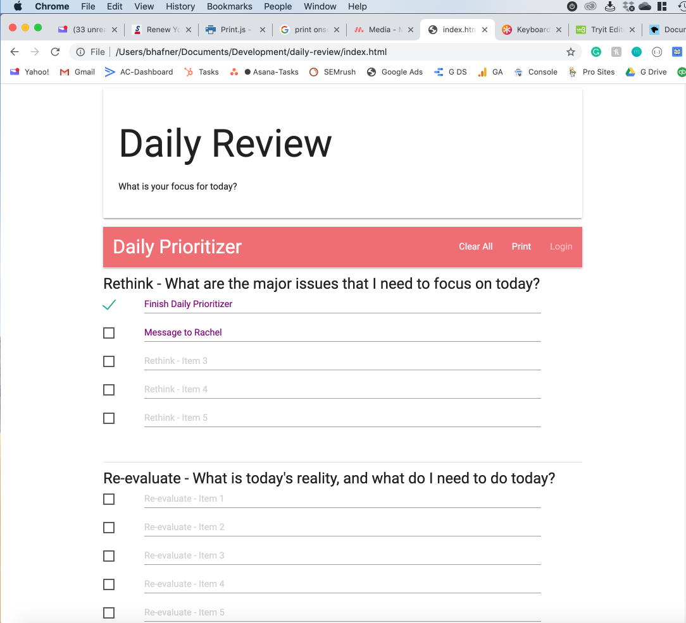

# Daily Prioritizer

This is a daily planner and prioritizer I have used for many years to help plan my work day.

## I cover five main areas:
----------------------------------------------------
1. **Rethink - What are the major issues that I need to focus on today?**
    - BIG PICTURE - These are things like commit daily-prioritizer to github, continue my job search, speak to Jean about performance issues
2. **Re-evaluate - What is today's reality, and what do I need to do today?**
    - WHAT DO I NEED TO ACTUALLY DO? - In reality, I used this as the "to-do" steps for the items in (1) above.
3. **Reorganize - How can I improve my productivity by reorganizing workflow or workspace today?**
    - HOW CAN I IMPROVE WORKFLOW EFFICIENCY? - this can be relatively simple such as buy file folders and file documents laying on desk, tryout a new planner or productivity software, finish projects a,b,c which are minor and won't take much time, but take a lot of mental energy knowing they are not done.
4. **Restructure - How can I spend more time on high-value efforts today?**
    - THIS IS A MORE BIG PICTURE VERSION OF (3) ABOVE - stop writing the weekly sales report every week if no one is reading it, offload project X to a junior colleague, say NO to any unnecessary commitments, or eliminate commitments that are a big drag without a big return.
5. **Reinvent - How can I reinvent myself today?**
    - THIS IS MORE BIG PICTURE AND FUTURE ORIENTED - I think of this as trying to "plant a seed (or seeds)" every day.  Some of those seeds might sprout in a few months, some in a few years, and some maybe never.  Planting the seeds of future success.

PLUS - **Maintaining Control** - *What is the one action I can take today that will most improve my effectiveness and help me reach my goals?*
i.e. What is the one thing I REALLY need to get done today, even if I don't get the others done.

Background:
----------------------------------------------------
Back in the early 2000s, when I was still living and working in Tokyo, I did a Brian Tracy coaching program with coach Rachel Parks, who happens to live here in San Diego county.

Technology:
----------------------------------------------------
I intend to make this a full-stack Javascript app with a MongoDB backend to persist data.  As of now, it stores data in localStorage, so it repopulates items you have entered if you open the link on the same computer.  I have used jQuery and the Materialize front-end library which is based on Google Material Design.

Materialize Library - https://materializecss.com/

Screenshot for Daily Prioritizer:
--------------------------------

